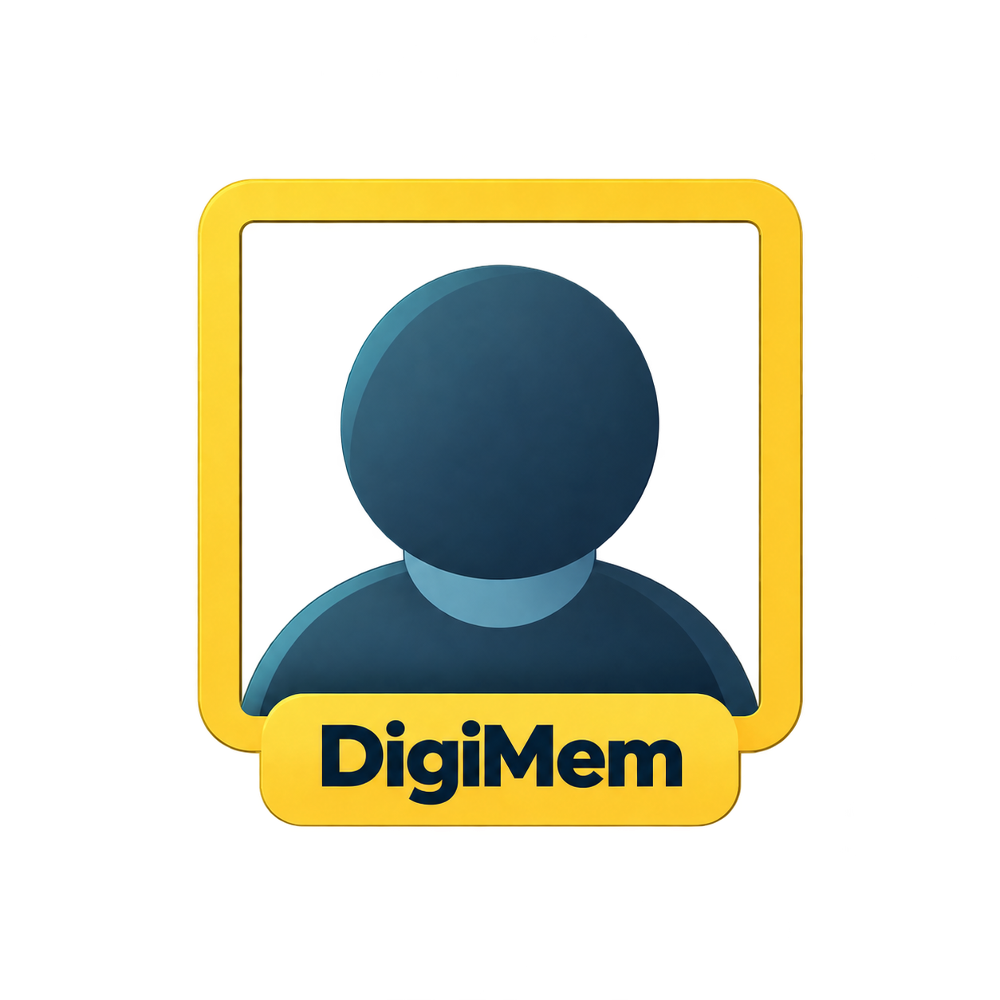

<p align="center">
  
</p>

# DigiMem

**Two-way face sync between digiKam and Nextcloud Memories.**

Name someone in digiKam and the name appears in Memories. Name someone in
Memories and it appears in digiKam. Face boxes travel the same way, so a face
one library has found and the other has not gets added rather than lost.

> [!NOTE]
>  <br>
> This project voluntarily adheres to The Friendly Manifesto. Read more [here](https://friendlymanifesto.org)

DigiMem runs quietly in the background on the computer where digiKam lives, and
opens a window when you want to see what it has been doing. It asks you
questions only when it genuinely cannot know the answer — when the same face
has a different name in each library — and keeps syncing everything else while
it waits.

- **Both directions**, names and face rectangles alike.
- **Automatic**, or only when you ask.
- **Safe with digiKam**: local writes happen only while digiKam is closed, and
  its database is copied first.
- **Interruptible**: a sync that is cut short resumes where it stopped rather
  than starting again.
- **Yours**: everything stays between your computer and your own Nextcloud.

## What you need

- digiKam, with the face tags you already use.
- A Nextcloud server running **Memories** and **Recognize**.
- The small **digiKam Face Sync** companion app on that server, which lets
  Recognize accept face boxes that came from digiKam.

Linux, macOS (Apple Silicon) and Windows.

## Getting started

Downloads are on the
[releases page](https://github.com/keithvassallomt/digikam-memories-sync/releases).

- **[Start here](docs/index.md)** — what DigiMem is and how the pieces fit.
- **[Installing DigiMem](docs/install-digimem.md)** — the desktop application,
  and connecting it to your two libraries.
- **[Installing the Nextcloud companion app](docs/install-nextcloud-app.md)** —
  the server side, done once.
- **[Using DigiMem](docs/using-digimem.md)** — every screen, and what to do
  with it.

## How it works, briefly

**It matches photos, not folders.** The two libraries do not have to be
arranged the same way. DigiMem works out which photo in Nextcloud is which
photo in digiKam, and compares the faces on them.

**It remembers what both sides agreed on.** For every face, DigiMem keeps the
name the two libraries last agreed on. That is what turns "these names differ"
into "this one was renamed, so rename the other" — and it is why you are only
asked about a face that changed on *both* sides, or one it has never seen
before.

**It notices changes rather than polling everything.** A change in either
library starts a short wait rather than an immediate sync, so twenty renames
produce one sync afterwards instead of twenty while you work. Where a change
can be pinned on one person, only that person is synced, which turns the common
case from minutes into seconds. A full sweep still runs daily as a safety net.

**It waits its turn.** DigiMem holds off while Recognize is busy with its own
work, and holds digiKam's half of a sync until you quit digiKam. Opening
digiKam part way through stops local writes within a second; the rest waits.

**Nothing is written until the whole picture is known.** A sync first reads
both libraries and produces a plan. Applying that plan re-checks each face
before touching it, records what it has done, and can pick the rest up later.
digiKam's database is copied before the first local change, into a `backups/`
folder you can find from the Settings screen.

The companion app is what makes the Nextcloud half possible: Recognize will not
accept a face box from elsewhere on its own. It is installed separately from
Recognize so that updating Recognize cannot overwrite it.

[docs/architecture.md](docs/architecture.md) has the full account, including
what DigiMem deliberately does not do.

## Development

```bash
python -m pip install -e '.[desktop]'
python -m unittest discover -s tests
```

[docs/architecture.md](docs/architecture.md) describes the parts, the
repository layout and how a sync actually runs.

## Licence

DigiMem is free software: you can redistribute it and/or modify it under the
terms of the GNU General Public License as published by the Free Software
Foundation, either version 3 of the License, or (at your option) any later
version. The full text is in `LICENSE`, and the program comes with no
warranty.

The Nextcloud companion app under `nextcloud-app/` is AGPLv3, as the Nextcloud
app store requires; its own `COPYING` applies there.

Copyright © 2026 Keith Vassallo.
